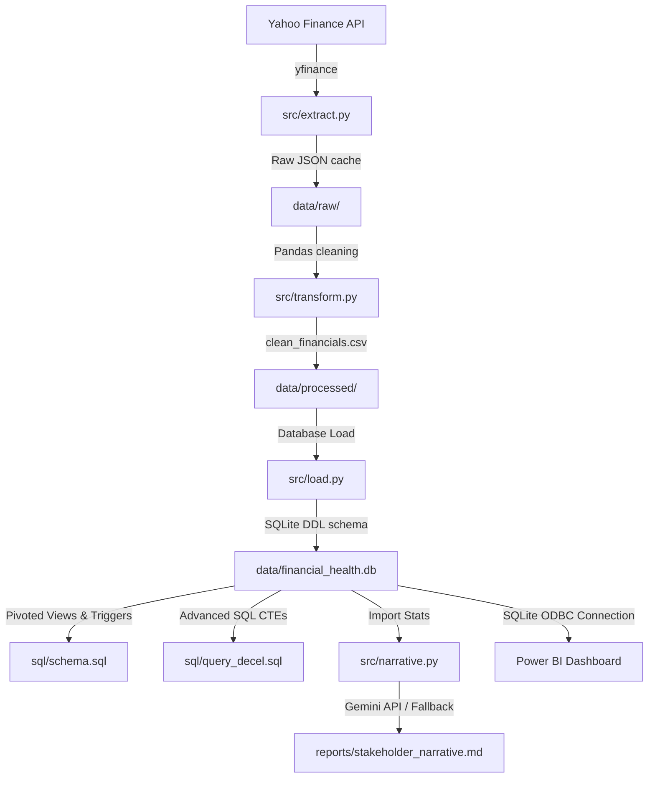
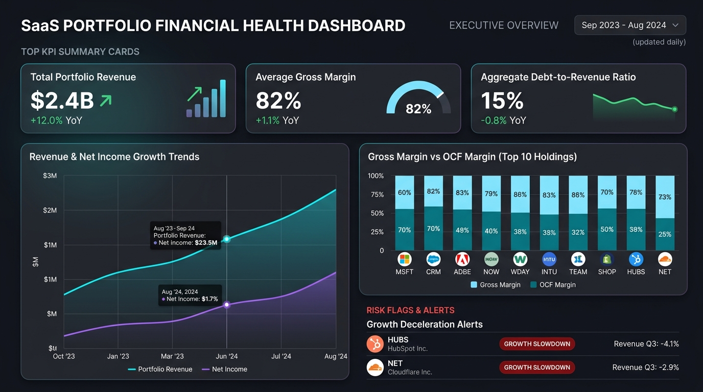

# Portfolio Company Financial Health Dashboard

An end-to-end data pipeline that extracts quarterly/annual financial data for 10 SaaS companies using `yfinance`, cleans and normalizes dates and metrics with Pandas, loads the structured data into a relational SQLite database, runs advanced CTE queries, documents a Power BI visual dashboard, and generates AI stakeholder narratives using the Google Gemini API (or a robust local analytical fallback).

---

## 1. Project Architecture



---

## 2. Technology Stack
- **Data Ingestion:** `yfinance` (v0.2.x), `pandas` (v2.x)
- **Database:** SQLite 3.x, `sqlite3` built-in connection adapter
- **AI Narrative:** `google-genai` (v0.1.x+), Google Gemini 2.0 API
- **Visualizations:** Power BI Desktop, SQLite ODBC Driver
- **Orchestration:** Python (v3.11+)

---

## 3. Quick Start & Execution

### Installation
1. Clone the repository.
2. Install Python dependencies:
   ```bash
   pip install -r requirements.txt
   ```
3. (Optional) Set up Google Gemini API credentials:
   Create a `.env` file at the project root:
   ```env
   GEMINI_API_KEY=your-api-key-here
   ```

### Running the Pipeline
Run the master orchestrator script:
```bash
# Execute entire pipeline (extract, transform, load, generate report)
python main.py

# Run pipeline skipping live Yahoo Finance calls (uses cached raw statements)
python main.py --skip-extract
```

---

## 4. Relational Schema & SQLite Database

Our SQLite database (`data/financial_health.db`) uses a normalized dimensional model:

- **`companies`**: Dimension table (`ticker` [PK], `company_name`, `sector`).
- **`financials`**: Fact table (`id` [PK], `company_id` [FK], `period_type`, `date`, `metric`, `value`, `last_refreshed`).
- **Update Trigger:** `update_financials_timestamp` automatically updates the `last_refreshed` column upon record edits.
- **Pivoted Views:** `quarterly_summary` and `annual_summary` pivot long fact records into clean wide layouts for direct querying.

---

## 5. Advanced SQL Queries & Findings

Our advanced analytical queries are stored under `sql/` and run directly on SQLite:

1. **YoY Growth Rates (`sql/query_yoy_growth.sql`):** Uses `LAG(revenue, 4)` window functions to compare calendar quarters year-over-year.
2. **Rolling Average Margins (`sql/query_margins.sql`):** Computes 4-quarter rolling averages for Gross and Operating Cash Flow margins.
3. **Deceleration Scanning (`sql/query_decel.sql`):** Identifies companies with 2+ consecutive quarters of quarter-on-quarter (QoQ) growth deceleration.

### Key Finding: Decelerating SaaS Holdings
Our scan flags HubSpot and Cloudflare as undergoing growth slowdowns:
- **HubSpot (HUBS):** Growth decelerated sequentially from 4.6% to 4.0% and then to 3.5%.
- **Cloudflare (NET):** Growth decelerated sequentially from 9.7% to 9.3% and then to 4.1%.

---

## 6. Power BI Dashboard Preview

The dashboard connects to our SQLite database via an ODBC driver. Here is the Executive Overview:



> [!NOTE]
> View connection details and DAX formulas inside [`dashboard/dashboard.md`](dashboard/dashboard.md).

---

## 7. AI Executive Stakeholder Narrative

The AI executive report generated by `src/narrative.py` is saved at [`reports/stakeholder_narrative.md`](reports/stakeholder_narrative.md). It outlines overall portfolio performance, risk assessments of decelerating holdings, and actionable portfolio weighting recommendations.
